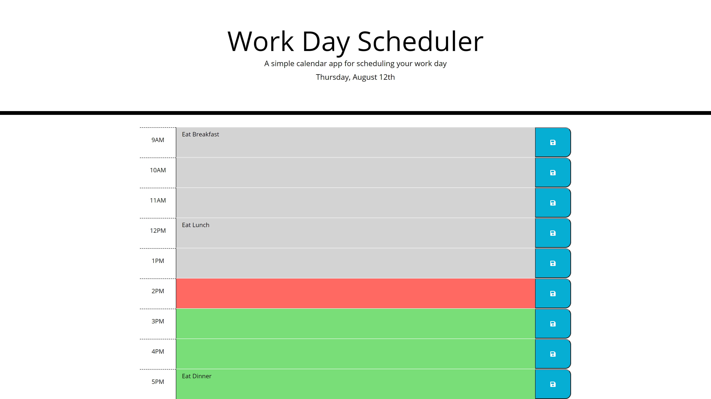

# Third-Party APIs: Work Day Scheduler

## Purpose

The Purpose of this project was to create a simple day planner the user can use to store tasks they need to do throughout the day. When saved, the tasks are locally stored to continue to be displayed when the page is refreshed. 

Some features of the quiz are:
- The current day is displayed at the top of the page using moment.js. 
- The time slots are color coded to show whether they are in the past, present, or future. Tasks in the past for the current day will be changed to future at midnight.  
- The user can iput tasks and hit the save button to locally store them. If the tasks are edited and not saved they will revert to the stored values on page load. 

The site can be found at: https://jpolmon.github.io/ScheduleHW05/

---
## Appearance

### Here is an example of the site with some tasks filled in:  

